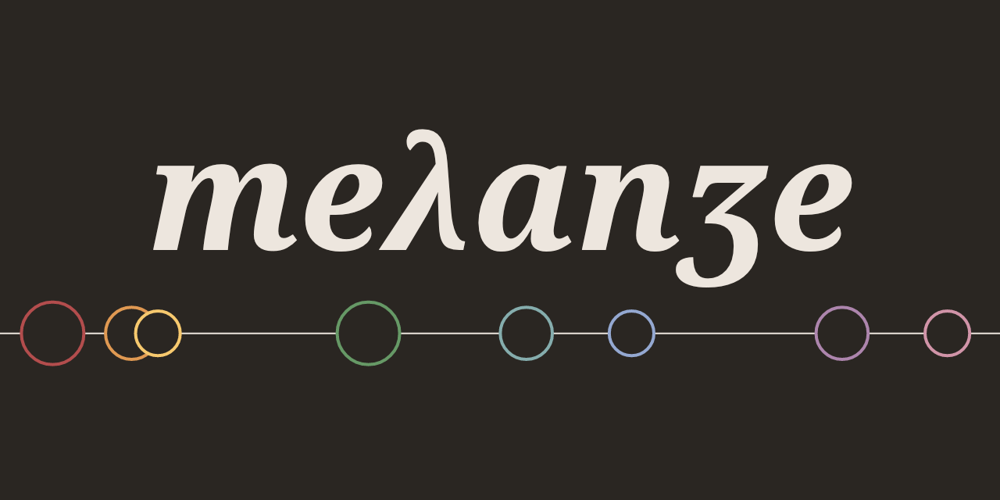
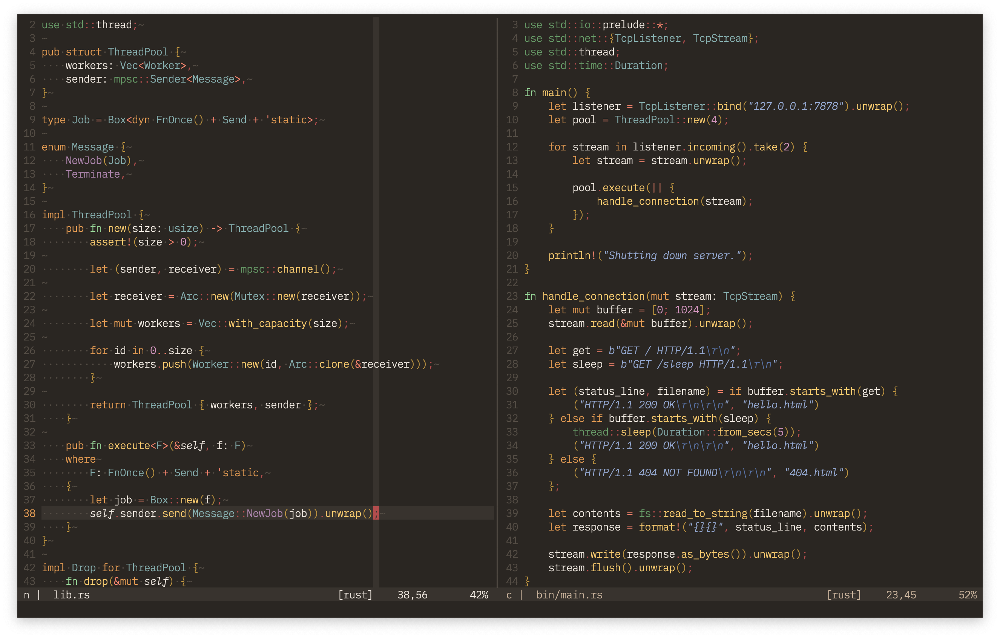
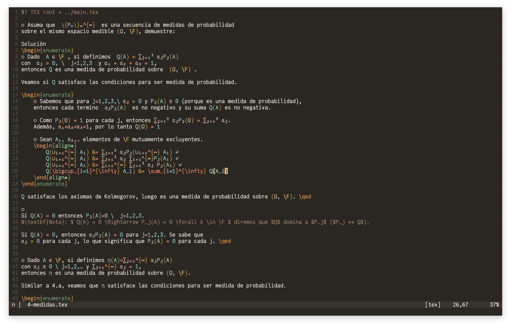
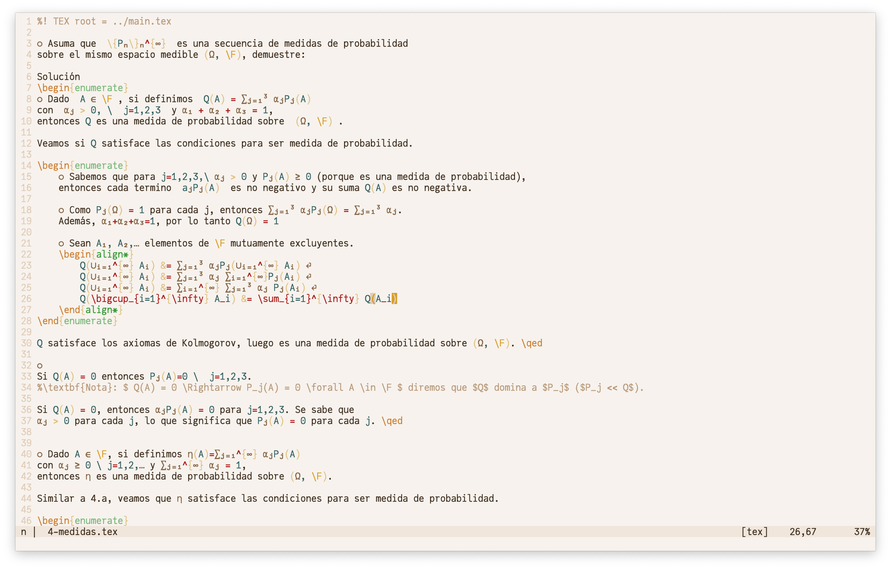

## Features
- Works with Neovim and Vim
- Dark and light variants
- Support for:
- LSP
- [nvim-treesitter](https://github.com/nvim-treesitter/nvim-treesitter) (Neovim only)
- [VimTeX](https://github.com/lervag/vimtex)
- Support for various terminal emulators:
  - [Alacritty](https://github.com/alacritty/alacritty)
  - [iTerm2](https://github.com/gnachman/iTerm2)
  - [Kitty](https://github.com/kovidgoyal/kitty)
  - [Wezterm](https://github.com/wez/wezterm)


## Design

Melange was developed with the following ideas in mind:

* _Control flow_ should use warmer colors and _data_ should use colder colors.
* No configuration. It's open source, fork it if you don't like something.
* Ayu and Gruvbox were the main inspirations.


## Requirements
* A terminal or GUI with true color and font variants support (italics, bold, etc).
* `termguicolors` enabled


## Installation

You can install Melange with any Neovim/Vim8 plugin manager.
For example, with [Packer](https://github.com/wbthomason/packer.nvim):
```lua
use "savq/melange"
```

Additionally, [nvim-treesitter](https://github.com/nvim-treesitter/nvim-treesitter)
can be used to install tree-sitter parsers.


## Usage

Enable `termguicolors` and load the `colorscheme`.

In your `init.vim`:
```vim
set termguicolors
colorscheme melange
```

Or in your `init.lua`:
```lua
vim.opt.termguicolors = true
vim.cmd("colorscheme melange")
```

To enable the light variant, set the `background` (or let your terminal do it for you)
before setting the colorscheme.


## Previews

nvim-treesitter + [IBM/plex](https://github.com/IBM/plex) Mono Light



VimTeX + `conceallevel=2` + [cormullion/JuliaMono](https://github.com/cormullion/juliamono)



