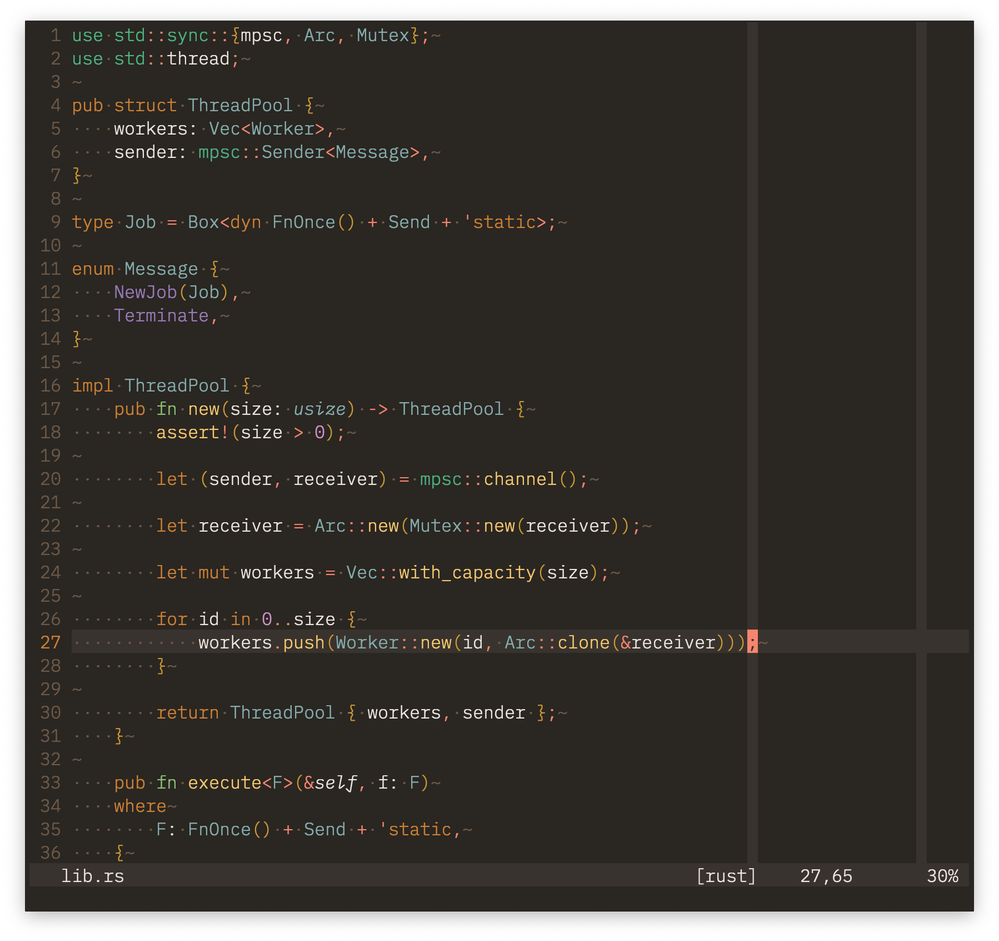

🚧 **WORK IN PROGRESS. See [TODO](TODO.md)** 🚧

## Features
- Works with Neovim and Vim
- Tree-sitter support (Neovim only)
- Dark and light variants
- Support for various terminal emulators:
  - [Alacritty](https://github.com/alacritty/alacritty)
  - [iTerm2](https://github.com/gnachman/iTerm2)
  - [Kitty](https://github.com/kovidgoyal/kitty)
  - [Wezterm](https://github.com/wez/wezterm)


## Design

Melange was developed with the following ideas in mind:

* _Control flow_ should use warmer colors and _data_ should use colder colors.
* No configuration. It's open source, fork it if you don't like something.
* Ayu and Gruvbox were the main inspirations.


## Requirements
* `termguicolors` enabled for true color support
* A terminal or GUI with font variants support (italics, bold, etc).


## Installation

With [Paq](https://github.com/savq/paq-nvim):
```lua
'savq/melange';
```

With [Packer](https://github.com/wbthomason/packer.nvim):
```lua
use 'savq/melange'
```

Additionally, [nvim-treesitter](https://github.com/nvim-treesitter/nvim-treesitter)
can be used to install tree-sitter parsers.


## Usage

Set the `colorscheme` option. 

In your `init.vim`:
```vim
colorscheme melange
```

Or in your `init.lua`:
```lua
vim.cmd("colorscheme melange")
```

To enable the light variant, set the `background` (or configure your terminal
to set it for you) before setting the colorscheme.


## Preview


